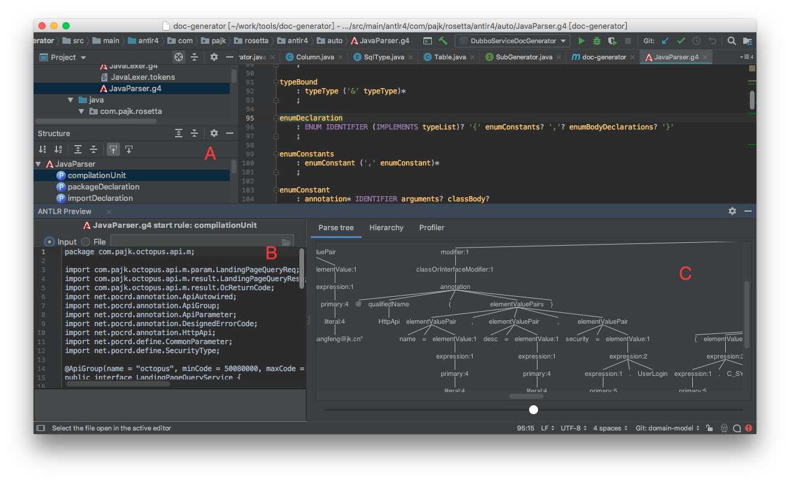

# 概览

本项目实现了一个简单的 LaTeX 文档生成工具。本文概要说明本工具的使用和开发方法。
本工具的主要功能有：

- 从项目中抽取信息，生成数据字典
- 从项目中抽取信息，生成 dubbo 接口文档
- 从项目中抽取信息，生成网关接口文档
- 混合手工编写的内容比如系统概述、术语、交互流程、文档修订历史等
- 生成方便排版的 Makefile

## 使用

本工具支持在 Java 8 及以上版本。之前版本无法运行。
本工具为 maven 插件项目的 LaTeX 文档使用之前请先在主项目的 pom.xml 文件中配置本插件示例如下：

    <plugin>
        <groupId>cf.tinkerit.mojo</groupId>
        <artifactId>doxgen-maven-plugin</artifactId>
        <version>1.0.0-SNAPSHOT</version>
        <configuration>
            <title>元数据系统开发手册</title>
            <subTitle>服务元数据系统 dingo</subTitle>
            <version>1.0</version>
            <authors>
                <author>
                    <name>张峰</name>
                    <email>schnell18@gmail.com</email>
                    <affiliation>Tinker 技术团队</affiliation>
                </author>
            </authors>
            <userContents>
                <param>doc/latex/summary.ftl</param>
                <param>doc/latex/term.ftl</param>
                <param>doc/latex/interaction.ftl</param>
            </userContents>
            <revisionTpl>doc/latex/revision.ftl</revisionTpl>
            <excludeTables>^.*?_\d+$|^.*?_bak$</excludeTables>
        </configuration>
    </plugin>

作者相关信息最多可以指定 4 个。version 是文档的版本，缺省值为 1.0。
userContents 是用户手工编写的文档模版。最多可以指定 100 个。文件是 freemarker 模版，只能使用相对路径。
工具将在当前目录下查找这些文件。如果模版放在子目录下，需要用斜杠分隔。
dubboPattern 及 mapiPattern 分别为 dubbo 接口和网关接口名称的匹配正则表达式，可空。
excludeTables 是不需要文档生成表的正则表达式，可选。上述例子中以数字或 bak 结尾的表不生成文档。

如果没有完成 schema.sql 文件，那么可以通过直接连接数据库的方式生成数据库文档。配置的示例如下：

    <plugin>
        <groupId>cf.tinkerit.mojo</groupId>
        <artifactId>doxgen-maven-plugin</artifactId>
        <version>1.0.0-SNAPSHOT</version>
        <configuration>
            <title>平安好医生平台开发手册</title>
            <subTitle>服务元数据系统 dingo</subTitle>
            <version>1.0</version>
            <authors>
                <author>
                    <name>张峰</name>
                    <email>schnell18@gmail.com</email>
                    <affiliation>Tinker 技术团队</affiliation>
                </author>
            </authors>
            <userContents>
                <param>doc/latex/summary.ftl</param>
                <param>doc/latex/term.ftl</param>
                <param>doc/latex/interaction.ftl</param>
            </userContents>
            <revisionTpl>doc/latex/revision.ftl</revisionTpl>
            <jdbcUrl>jdbc:mysql://localhost:3307/dingo?zeroDateTimeBehavior=convertToNull</jdbcUrl>
            <jdbcUserName>mfg</jdbcUserName>
            <jdbcPassword>abc</jdbcPassword>
        </configuration>
    </plugin>

接下来就可以执行：

    mvn compile cf.tinkerit.mojo:doxgen-maven-plugin:generate

为简化命令，可以在～/.m2/settings.xml 文件中加入：

    <pluginGroups>
      <pluginGroup>cf.tinkerit.mojo</pluginGroup>
    </pluginGroups>

然后只用使用 doxgen 来指定这个插件。

    mvn compile doxgen:generate

以上命令都加上 compile，目的是避免对无法编译的源代码进行文档生成。
你可以根据实际情况酌情使用。
生成的文档放在新生成的 target/latex 子目录下。生成内容示例如下：

    latex/
    ├── Makefile
    ├── datamodel
    │         ├── app-module.tex
    │         ├── app-ver.tex
    │         ├── app.tex
    │         └── service-type.tex
    ├── dubbo
    │         ├── AppServeTypeGroupMaintenanceService.tex
    │         ├── BizScenarioAdminService.tex
    │         └── domain-model.tex
    ├── images
    │         └── logo.png
    └── manual.tex
    └── mapi
        ├── LandingPageQueryService.aux
        ├── LandingPageQueryService.tex
        ├── PopupService.tex
        └── domain-model.tex

最后，你需要使用 LaTeX 工具链，将上述 LaTeX 源代码编译成 PDF 文件。

## 开发

为了扩展本工具的使用场景，需要更多的开发人员参与到本工具的
开发和维护工作中来。本文档旨在帮助开发者快速入门本工具的开发和维护工作。

### 工具准备

开发本工具建议使用 IntelliJ Idea 最新的社区版。
本工具是基于 ANTLR4 这个语法分析器生成工具设计。开发过程中经常需要
实时预览抽象语法树 (AST Abstract Syntax Tree)，以便编写正确的处理
程序。因此，请安装 ANTLR v4 grammar plugin。
该插件可以从[此下载][1]，也可以在 Idea 中安装。

此外，你还需要 LaTeX 工具链，具体的安装方法请参考 rosetta 主项目的 README。
以下是所涉工具的清单：

- ANTLR v4 grammar plugin
- IntelliJ Idea
- Maven
- LaTeX distribution(MacTeX/TeXlive/MikTeX)
- TeXworks

### 使用 ANTLR 4 grammar plugin 预览语法树

大致步骤如下：
- 在 Idea 里选择相应的语法文件并打开，本例使用 JavaParser.g4
- 点击 structure，展示该语法文件的结构
- 选中一个你需要预览的语法规则，本例中是 compilationUnit
- 唤起右键菜单，点击第一个，本例中是 Test Rule compilationUnit
- 唤起右键菜单，点击第一个，本例中是 Test Rule compilationUnit
- 在下图的 B 区域输入或选择需要分析的 Java 源代码
- 语法树将展示在图的 C 区域

### 使用 ANTLR 4 自带工具预览语法树

预览抽象语法树也可用 ANTLR 4 提供的单独工具。
它自带的 GUI 工具可以选择语法树的子树进行渲染展示。
使用该工具需要从 antlr 官网下载 [antlr-complete.jar][2]。
并创建如下命令脚本 grun:

    #!/bin/sh

    java -cp ".:/path/to/antlr-complete.jar:$CLASSPATH" \
        org.antlr.v4.gui.TestRig $*

以 Java 为例，展示给定 Java 文件的抽象语法树的命令行如下：

    grun cf.tinkerit.doclet.antlr.auto.Java compilationUnit -gui < XXX.java

该工具的界面如下：

### 使用 JDBC 说明

为了能产生表的说明，链接 MySQL 的 JDBC URL 上需要注意以下参数：

- useInformationSchema=true
- useUnicode=true
- characterEncoding=utf-8
- zeroDateTimeBehavior=convertToNull

第一个参数是为了避免 MySQL JDBC 驱动程序 Connector/J 自身的 bug 导致
表注释没有在 DatabaseMetaData 的结果集中返回。 具体的 bug 详情请参考
[Connector/J does not retrieve the table comment in a
InnoDB table][3]。 第二、三个参数是为了保证中文注释不出现乱码问题。
如果不指定前三个参数中的任何一个，本工具会自动添加。

[1]: https://plugins.jetbrains.com/plugin/7358-antlr-v4-grammar-plugin
[2]: https://www.antlr.org/download/antlr-4.7.2-complete.jar
[3]: https://bugs.mysql.com/bug.php?id=65213

